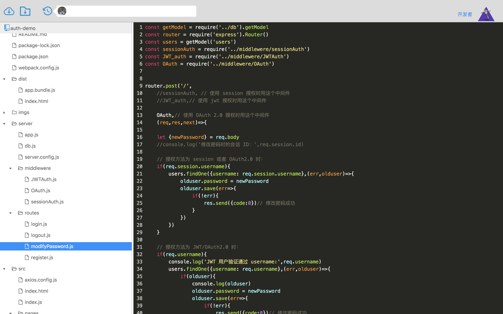

# Github-code-viewer

使用 Electron 和 React 制作的一个可以克隆 github 仓库代码，并生成文件树查看的代码阅读器（支持本地仓库文件查看）



## 技术栈

1. 框架：

- Electron.
- React && Redux.
- Express.
- Webpack.

2. 重要组件：

| 组件 |  用途  |
| --- | --- |
|  [npm 模块 react-codemirror](https://www.npmjs.com/package/react-codemirror)  |  代码编辑器  |
|  [github API 库 octonode](https://github.com/pksunkara/octonode) |  获取用户的 GitHub 账号下的 API，如仓库文件及其内容  |

## 开发

1. 使用 [create-electron-app](https://www.electronforge.io/) 脚手架快速开始 electron 的开发环境: `npx create-electron-app Github-code-viewer --template=webpack`，使用 `npm start `启动编译运行 electron 应用. 

~~2. 开发中为了增加 GitHub API 调用上限，需要到 github 的 setting > developer settings > Personal access tokens，创建一个token，然后在发起 API 请求前设置 token~~（*这个我改成了用户登录时获取token，不用开发者自己到 github 申请 token*）：
```js
const {github_token} = require('../../config')
let client = github.client(github_token)
```
⚠️注意：在开发完后，将项目代码 commit 到 GitHub 后，原来的 github token 会失效，这是因为 github 为了防止 代码中暴露的 token 会造成用户在GitHub 的数据被攻击而做的防御措施。所以 commit 后，开发中必须开发者自己新申请一个新的 token，否则请求 GitHub 的 API 会返回 `Bad credicial`。这个问题现在不用开发者重复申请 token 了，因为我已经改成用户登录时自动获取 token，之后克隆远程仓库等都会使用这个 token。

## 打包发布


## 亮点

1. 使用递归解决了目录树的文件内容的读取和文件树在页面的渲染：

>递归读取文件树的代码请看[这里](https://github.com/qumuchegi/github-code-viewer/blob/e1ba1e63f6f38f5e70693df426da38f3a2c20e1d/src/main/server-routes/middleweres.js#L83)，具体的原理是使用 promise 里的 fs 读取目录，fs 读取目录结果出来后 resolve 出读取结果，循环读取里面的文件，如果遇到目录就递归调用原来用于读取目录的 promise ，直到不再有可读取的文件就 resolve 出整个读取结果。为什么要把fs读取目录的逻辑嵌套在一个 promise 里呢，这是因为在 fs 读取目录时使用了异步读取，只有父级目录读取完才能得到下面一级的目录，进而在 promise.then 之后继续读取下一级的目录。

>下面是递归渲染文件树：

```js
function dynamicCreateChildrenTree (dirPaths) { // 使用递归 动态生成子目录树
    let children = dirPaths.sort((a,b) => a-b)
    .map(el => 
        el.type === 1 ?
        <TreeNode 
          isLeaf={true} 
          title={el.name} 
          key={el.path}></TreeNode>
        :
        <TreeNode 
          isLeaf={false}  
          title={el.name} 
          key={el.path} 
         >
           {
            dynamicCreateChildrenTree(el.pathsArr)
           }
        </TreeNode>
      )
   //console.log(children)
    return children
  }

  return(
    <div id="prj-tree">
      <DirectoryTree 
        multiple 
        defaultExpandAll 
        onSelect={onSelect} 
        onExpand={onExpand}
      >
        {dynamicCreateChildrenTree(dirPaths)}
      </DirectoryTree>
    </div>
  )
```

2. 使用 React 模拟前端，Node.js 模拟后端 API，Electron 链接了两者，借用 Electron 的 ipc 进程通信模拟了 C/S 模式，main 进程模拟 S 服务，render 进程模拟 C 客户端，从而分理处清晰的项目逻辑结构。

## 疑问解决

1. 打包应用的时候对图片不能用 file-loader, 只能用 url-loader 生成 data url, 否则应用里图片显示有问题。不知道原因？
2. electron 打包后功能缺失，左边是没有打包的，右边是打包之后的，打包后原本应该显示图片的地方图片没有了，试了其他的功能，也谜一般的“消失了”:
<div >


</div>

>这个应该是路由问题，针对这个问题，我采取了妥协办法，即不再使用 React router，而是直接用下面的内容组件取代原来的路由：

```js
<Provider store={store}>
  <Header/>
  <RepoContent/>
  {/*<Routers/>*/}
</Provider>
```
这样就解决了。

这样后，发现了另一个问题，就是代码编辑器的样式没有了，直接背景变成了白色,应该是引入的编辑器的问题：
